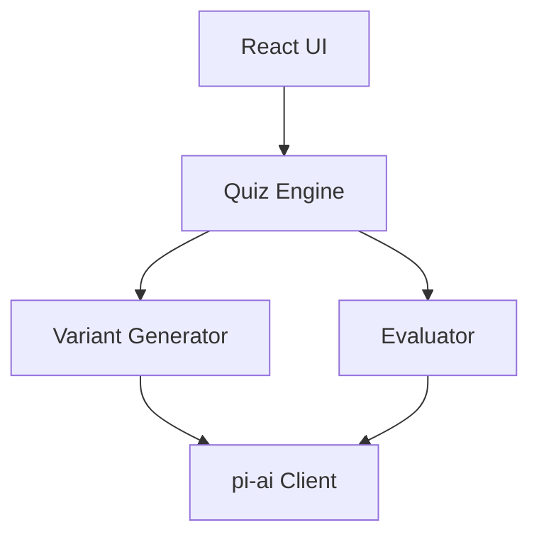
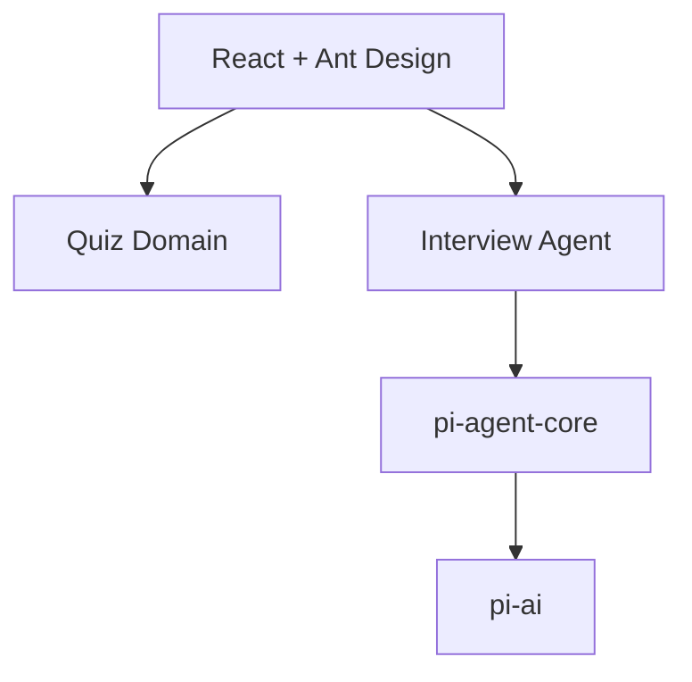
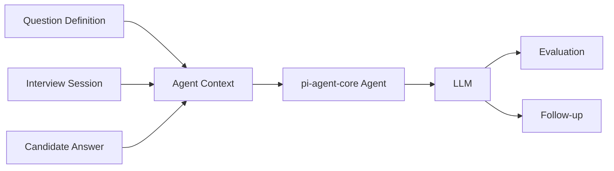
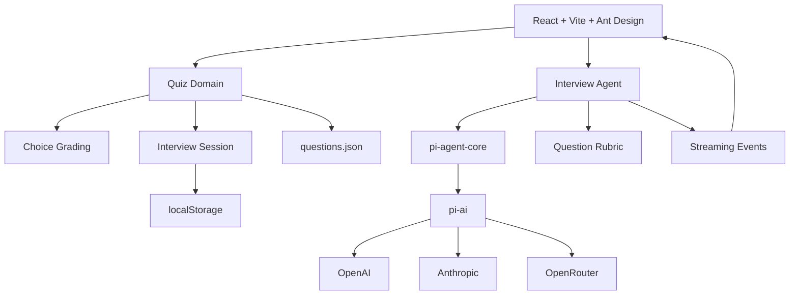
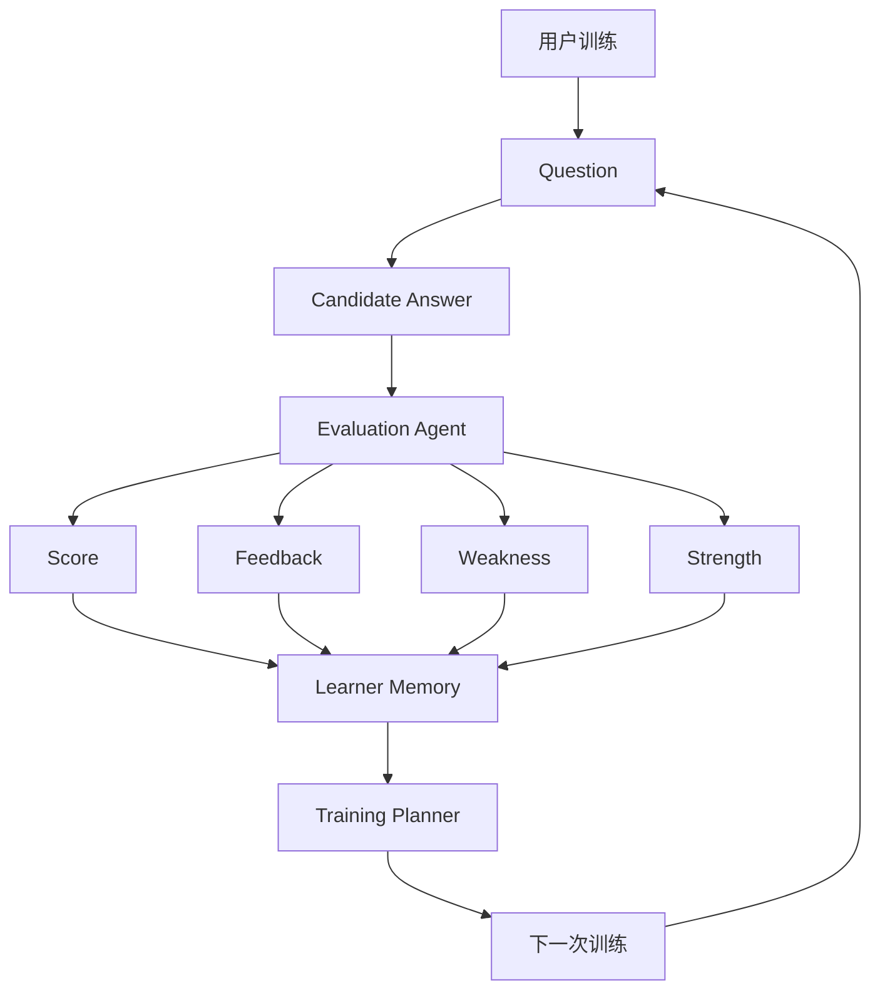
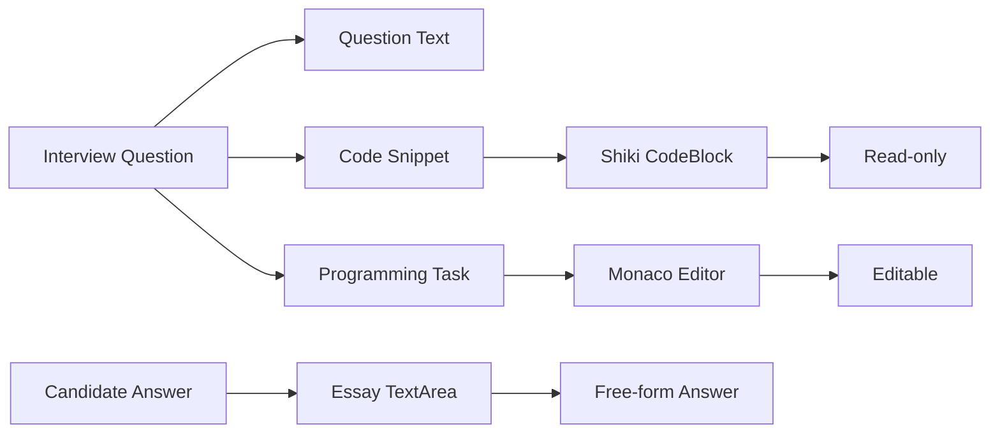

可以，而且我看完 `@earendil-works/pi-agent-core` 当前设计后，结论是：

> **可以用，但不要让 `pi-agent-core` 接管整个 Quiz Engine。**
>
> 最合适的方式是：**React/Vite 负责 UI + Quiz domain，`pi-agent-core` 只负责“LLM Agent 层”。**

`pi-agent-core` 本身就是一个有状态、支持 tool execution、event streaming 的 agent runtime，底层基于 `pi-ai`。它还支持自定义 `AgentMessage`、context transformation、tool calling 和 streaming。([GitHub][1])

这实际上能让你后面做 **AI Interviewer** 时少写很多 orchestration code。

---

# 1. 你现在的架构，可以砍掉一层

你原来的设计大概是：



我会改成：



也就是说：

### Quiz Engine

继续自己写：

```text
抽题
随机化
单选判分
多选判分
进度
Session
Result
```

这些根本不需要 Agent。

### Interview Agent

交给：

```text
@earendil-works/pi-agent-core
        ↓
@earendil-works/pi-ai
```

负责：

```text
LLM conversation
streaming
state
tool calling
follow-up
agent lifecycle
```

这会更干净。

---

# 2. 最有价值的是把 Essay Evaluation 变成 Agent

你现在可能想写：

```text
piClient.ts
├── generateVariant()
└── evaluateEssay()
```

其实可以升级成：

```text
ai/
├── interviewAgent.ts
├── variantAgent.ts
└── evaluationAgent.ts
```

甚至第一版可以只有一个：

```text
InterviewAgent
```

例如：

```ts
const agent = new Agent({
  initialState: {
    systemPrompt: EVALUATION_PROMPT,
    model,
  },
  streamFn: models.streamSimple.bind(models),
});
```

然后：

```ts
await agent.prompt(`
Question:
${question}

Reference Answer:
${referenceAnswer}

Candidate Answer:
${candidateAnswer}
`);
```

通过事件订阅拿 streaming output。`Agent` 本身提供 `subscribe()`，可以监听 `message_update`、`agent_end` 等事件。([GitHub][1])

React 侧就可以很自然地：

```text
Candidate submits
        ↓
React
        ↓
InterviewAgent
        ↓
pi-agent-core
        ↓
LLM
        ↓
streaming events
        ↓
React state
        ↓
Evaluation UI
```

---

# 3. 更重要的是：它非常适合你未来的“面试官模式”

这其实是我认为你**应该使用 pi-agent-core 的主要原因**。

你现在：

```text
Question
↓
Answer
↓
Score
```

属于：

> AI-assisted quiz

但是以后很容易变成：

```text
Interviewer Agent
       │
       ↓
"What is RAG?"
       │
       ↓
Candidate Answer
       │
       ↓
Agent evaluates
       │
       ↓
"Can you explain why naive RAG
can fail for multi-hop questions?"
       │
       ↓
Candidate Answer
       │
       ↓
Agent evaluates
       │
       ↓
"How would you improve it?"
```

这就是典型 Agent loop。

而 `pi-agent-core` 本身就是为 stateful agent + event streaming + tool execution 设计的。([GitHub][1])

你不需要自己重新实现：

```text
conversation state
LLM call loop
streaming
tool calls
event lifecycle
continue
```

---

# 4. 甚至可以把“题目”变成 Agent 的上下文

我会设计成：



比如 Agent 的 context：

```text
System:
You are a senior ML interviewer.

Interview:
Agentic AI

Difficulty:
Hard

Question:
Design an agentic RAG system...

Reference rubric:
...

Candidate:
...
```

然后 Agent 自己决定：

```text
evaluate
↓
ask follow-up
↓
evaluate
↓
ask follow-up
↓
finish
```

这比：

```ts
evaluateEssay()
```

强很多。

---

# 5. 你的 `questions.json` 也可以因此升级

我之前建议增加 rubric，现在更加有意义。

例如：

```json
{
  "id": "agent-rag-01",
  "category": "agentic-ai",
  "topic": "agentic-rag",
  "type": "essay",
  "difficulty": "hard",

  "question": "Design an agentic RAG system...",

  "referenceAnswer": "...",

  "rubric": {
    "required": [
      "retrieval strategy",
      "tool calling",
      "query planning",
      "failure handling"
    ],
    "dimensions": {
      "correctness": 0.35,
      "completeness": 0.25,
      "architecture": 0.25,
      "communication": 0.15
    }
  }
}
```

然后：

```text
question.json
       ↓
Interview Agent
       ↓
Rubric
       ↓
Candidate Answer
       ↓
LLM
       ↓
structured evaluation
```

这比简单的：

```text
"请给答案打 0-100 分"
```

可靠得多。

---

# 6. Variant 也可以用 Agent，但我反而建议第一版不要

这是一个很重要的边界。

你现在有：

```text
LLM Variant
```

例如：

```text
Canonical Question
       ↓
LLM
       ↓
Variant
```

这个可以使用 `pi-agent-core`，但**没有必要**。

因为 Variant Generator 本质上是：

```text
one-shot structured generation
```

而不是 agent。

所以：

```text
Variant → pi-ai
```

就够了。

而：

```text
Interview → pi-agent-core
```

才真正值得。

---

# 7. 因此我最终会把你的架构变成这样



对应代码：

```text
src/
├── data/
│   └── questions.json
│
├── domain/
│   ├── quiz.ts
│   ├── grading.ts
│   └── session.ts
│
├── ai/
│   ├── models.ts
│   ├── interviewAgent.ts
│   └── variantGenerator.ts
│
├── components/
│   ├── quiz/
│   ├── interview/
│   ├── result/
│   └── settings/
│
├── storage/
│   └── settings.ts
│
├── types/
│   └── question.ts
│
├── App.tsx
└── main.tsx
```

这样你甚至可以**删除原来比较重的 `piClient.ts`**。

---

# 8. 但有一个现实问题：Browser + Vite

这里需要特别注意。

`pi-agent-core` 当前 package 声明的 Node engine 是 `>=22.19.0`。([GitHub][2])

所以你不能简单假设：

```text
Vite browser
    ↓
直接 import pi-agent-core
    ↓
一定完全没问题
```

它虽然提供 browser-oriented proxy 用法，例如 `streamProxy`，官方 README 就有 browser app 通过 backend proxy 的模式。([GitHub][3])

也就是说你有两个架构选择。

### A. 纯浏览器 local-first

```text
React
 ↓
pi-agent-core
 ↓
pi-ai
 ↓
LLM API
```

优点：

* 极简
* 不需要服务器
* API key 本地

缺点：

* browser compatibility 需要实际验证
* API key 安全性有限
* CORS

### B. Browser + tiny backend

我其实更推荐：

```text
React/Vite
     ↓
Interview Agent UI
     ↓
Backend
     ↓
pi-agent-core
     ↓
pi-ai
     ↓
LLM
```

甚至后端只需要：

```text
POST /api/interview
POST /api/evaluate
POST /api/variant
```

这样 `pi-agent-core` 放 Node 侧。

---

# 9. 还有一个值得注意的点：bundle

当前 `pi-agent-core` 有一个值得关注的 bundling 问题：GitHub 上有 issue 指出 `Agent` 对 `pi-ai/compat` 的静态依赖可能把大量 provider/catalog 带进 Vite/Rollup bundle，即使应用显式提供自己的 `streamFn`。这个 issue 在 2026-07 被提出。([GitHub][4])

所以如果你坚持：

```text
React + Vite
       ↓
browser
       ↓
pi-agent-core
```

我会在项目早期就测试：

```bash
npm run build
```

然后检查 bundle size。

**这不是不能用，而是不要等项目做完才发现 bundle 很重。**

---

# 10. 所以我的建议非常明确

如果你的目标只是：

> 做一个 10 道题的 AI Quiz

那么：

```text
React
+
pi-ai
```

就够了。

但如果你的目标是之前说的：

> **Agentic AI Interview Trainer**

那我非常建议：

```text
React + Vite
        +
Quiz Domain
        +
pi-ai
        +
pi-agent-core
```

而且职责划分为：

| 能力                       | 技术                              |
| ------------------------ | ------------------------------- |
| UI                       | React + Ant Design              |
| Routing                  | React Router                    |
| Quiz                     | 自己实现                            |
| Choice grading           | 自己实现                            |
| Question bank            | JSON                            |
| LLM provider abstraction | `pi-ai`                         |
| Question variant         | `pi-ai`                         |
| Essay evaluation         | `pi-agent-core`                 |
| Interview conversation   | `pi-agent-core`                 |
| Follow-up questions      | `pi-agent-core`                 |
| Tool calling             | `pi-agent-core`                 |
| Streaming                | `pi-agent-core`                 |
| Session state            | Agent state + 自己的 session model |

**核心原则就是：不要为了“用了 Agent”而把所有东西 Agent 化。**

`pi-agent-core` 最有价值的地方不是帮你调用一次 LLM，而是帮你把未来的：

> **“AI 出题 → 候选人回答 → 评价 → 追问 → 再评价 → 最终面试报告”**

这一整套 **stateful interview loop** 变得非常简单。它的 `Agent` 已经提供状态、事件流、tool execution 和继续执行等机制。([GitHub][1])

这会让你的项目从普通的 **AI Quiz** 很自然地演进成真正的 **Agentic AI Interview Trainer**。

[1]: https://github.com/earendil-works/pi/blob/main/packages/agent/README.md "pi/packages/agent/README.md at main · earendil-works/pi · GitHub"
[2]: https://github.com/earendil-works/pi/blob/main/packages/agent/package.json?utm_source=chatgpt.com "pi/packages/agent/package.json at main · earendil-works/pi · GitHub"
[3]: https://github.com/earendil-works/pi/blob/main/packages/agent/README.md?utm_source=chatgpt.com "pi/packages/agent/README.md at main · earendil-works/pi · GitHub"
[4]: https://github.com/earendil-works/pi/issues/6851?utm_source=chatgpt.com "pi-agent-core's Agent statically imports /compat, pulling all built-in providers into bundles that never use them · Issue #6851 · earendil-works/pi · GitHub"


------------------


对，我觉得你现在这个界面**确实有点“配置中心化”了**。它把很多“系统内部概念”暴露给用户了：

* Interview Definition
* 题目数量
* 类别
* 难度
* 题型
* AI 变体
* 开放题评分权重
* API Key 状态

对于一个 **Interview Trainer**，用户真正想做的事情其实只有：

> **“我今天想练什么？” → “开始练” → “回答” → “告诉我哪里不足” → “下次继续练”**

所以我会把产品从 **Quiz Configurator** 转成 **Training Coach**。

而且你说的“存储记忆、记录交互、打分、给建议”，我认为不是锦上添花，**应该成为这个产品的核心设计**。

---

# 1. 首页应该从“配置”变成“训练入口”

现在：

```text
配置你的训练
──────────────

题目数量
类别
难度
题型
AI
评分
API Key

[开始训练]
```

我更建议：

```text
🧠 AI 面试训练器

      今天练什么？

┌─────────────────────────────────────┐
│  🤖 Agentic AI                      │
│                                     │
│  上次得分 78                         │
│  薄弱项：Tool Calling · Evaluation  │
│                                     │
│  [继续训练]                          │
└─────────────────────────────────────┘

┌──────────────┐ ┌──────────────┐
│ 快速训练     │ │ 模拟面试     │
│ 10 道题      │ │ AI 面试官     │
│              │ │ 30 分钟       │
│ [开始]       │ │ [开始]        │
└──────────────┘ └──────────────┘

最近训练
─────────────────────────────
Agentic AI       78%    昨天
RAG              85%    3 天前
LLM Fundamentals 72%    5 天前
```

这样用户**不用理解你的内部数据模型**。

---

# 2. 高级配置应该隐藏起来

你现在这些选项不是不要，而是：

> **不要全部放在第一屏。**

例如点击：

**自定义训练**

才展开：

```text
自定义训练

主题
[ Agentic AI ▼ ]

难度
○ 简单  ● 中等 ○ 困难

题型
☑ 选择题
☑ 问答题
☐ 编程题

题数
[ 10 ]

AI
☑ AI 变体
☑ AI 评分

        [开始训练]
```

而：

```text
评分权重
正确性 40%
完整性 20%
架构 20%
表达 20%
```

**我建议直接隐藏。**

这是系统内部的 evaluation rubric，不应该成为普通用户需要理解的配置。

---

# 3. API Key 也不应该出现在训练配置里面

你现在这个：

> 尚未配置有效的 API Key

实际上把一个**技术实现细节**暴露到了核心 UX。

更好的方式：

右上角：

```text
⚙ 设置
```

里面：

```text
AI 设置

Provider
○ OpenRouter
○ OpenAI
○ Anthropic

Model
[ Claude ... ▼ ]

API Key
[ ••••••••••• ]

☑ 保存到本机

[测试连接]
```

首页只需要：

```text
AI ✓
```

或者：

```text
AI 未配置 · 设置
```

而不是一个黄色的大 Alert。

---

# 4. 我尤其赞成你说的“记忆”

而且这里我会区分两个概念：

### Training History

记录：

```text
这一次答了什么
得多少分
什么时候训练
```

### Learner Memory

记录：

```text
这个人长期擅长什么
哪里薄弱
最近进步什么
哪些问题反复答错
```

后者才是真正有价值的。

---

# 5. 你这个项目实际上应该有一个 Learner Model

例如：

```ts
interface LearnerProfile {
  totalSessions: number;
  totalQuestions: number;

  overallScore: number;

  strengths: TopicPerformance[];
  weaknesses: TopicPerformance[];

  topicStats: Record<string, TopicStats>;

  recentAttempts: Attempt[];

  recommendations: Recommendation[];
}
```

例如：

```json
{
  "topic": "agent-tool-calling",
  "attempts": 12,
  "score": 68,
  "trend": "improving",
  "mastery": 0.61,
  "commonWeaknesses": [
    "error handling",
    "schema validation"
  ]
}
```

这时候系统就能知道：

> 你不是“昨天做了 10 道题”。

而是：

> **你在 Tool Calling 上连续 3 次暴露出 error handling 不足。**

这就开始像真正的 Trainer 了。

---

# 6. 更进一步：让 Agent 维护“学习记忆”

这其实和你前面问的 `pi-agent-core` 非常契合。

可以形成：



于是下一次用户打开：

> **“继续训练”**

系统不是随机抽 10 道题。

而是：

```text
根据你的历史表现：

Agentic AI
├── Tool Calling       68% ← 优先
├── Agent Evaluation   72% ← 优先
├── Memory             81%
└── Planning           88%

推荐今天：
8 道 Tool Calling
2 道 Agent Evaluation
```

这才是真正的 **AI Interview Trainer**。

---

# 7. 我甚至不建议一开始就让用户选择“10 道题”

可以提供：

```text
快速训练
```

默认：

> **练习 10 分钟**

而不是：

> 选择 5 / 10 / 20 / 30 道题。

因为训练的核心单位其实应该是：

> **Training Session**

而不是：

> Quiz。

例如：

```text
快速训练
────────────────

根据你的学习记录，
AI 会自动选择今天最值得练习的题目。

预计 10 分钟

[开始训练]
```

高级用户仍然可以：

```text
自定义训练
```

---

# 8. 我会把整个产品设计成 4 个页面

非常简单：

```text
┌─────────────────────────────────────┐
│ 🧠 AI Interview Trainer             │
│                                     │
│ 训练    进度    面试    设置        │
└─────────────────────────────────────┘
```

## ① 训练

```text
今天练什么？

[继续训练]

快速训练
────────────────
根据你的薄弱项自动生成

[开始]

自定义训练
────────────────
主题 / 难度 / 题型

[开始]
```

---

## ② 训练过程

尽可能简单：

```text
Agentic AI                     3 / 10

────────────────────────────────

为什么 Agent 需要 Tool Calling？

○ A ...
○ B ...
○ C ...
○ D ...

────────────────────────────────

[提交答案]
```

问答题：

```text
请解释 Agentic RAG 如何处理
multi-hop question。

┌──────────────────────────────┐
│                              │
│                              │
│                              │
└──────────────────────────────┘

[提交回答]
```

不要在这个页面放太多配置。

---

# 9. ③ Result 不应该只是“78分”

应该成为训练价值最高的页面：

```text
训练完成

                    78
                   /100

↑ 比上次 +6

────────────────────────

表现很好
✓ RAG fundamentals
✓ Tool selection

需要加强
△ Error handling
△ Agent evaluation

────────────────────────

AI 建议

你已经能够解释 Agent 的基本
tool calling 流程，但在回答中
对 failure recovery 的讨论比较薄弱。

建议下一次重点练习：

[Error Handling in Agents]

[继续训练]
```

这时候用户会觉得：

> “这个东西真的在训练我。”

---

# 10. ④ Progress

这是你现在产品里**非常值得增加的一页**。

例如：

```text
我的进步

Overall
━━━━━━━━━━━━━━ 78%

Agentic AI
━━━━━━━━━━━━ 81%

RAG
━━━━━━━━━━━ 76%

LLM
━━━━━━━━━━━━ 84%

System Design
━━━━━━━ 61%

────────────────────

最近趋势

100 ┤
 90 ┤          ╭─╮
 80 ┤     ╭────╯ ╰──╮
 70 ┤─────╯          ╰──
 60 ┤
    └──────────────────
      Aug 10  15  20  23

────────────────────

需要关注

🔴 System Design
🟠 Agent Evaluation
🟢 RAG
```

---

# 11. 这时候 `localStorage` 可以先完全够用

第一版不需要数据库。

可以：

```text
localStorage
│
├── settings
│
├── learner-profile
│
├── sessions
│
├── attempts
│
└── recommendations
```

甚至我建议：

```text
IndexedDB
```

如果你开始保存比较多的：

* 对话
* AI evaluation
* interview session
* streaming result

会比 `localStorage` 更合理。

但是 **MVP 先 localStorage 完全没问题**。

---

# 12. 最关键的一点：不要把“Memory”设计成聊天记忆

我不建议：

```text
把所有用户历史对话
        ↓
塞给 LLM
```

这很快会变得：

* context 很大
* 贵
* 不稳定
* 记忆质量差

应该是：

```mermaid id="zqj0bc"
Raw Attempts
      ↓
Evaluation
      ↓
Structured Learning Signals
      ↓
Learner Profile
      ↓
Compact Memory
```

例如：

```json
{
  "weaknesses": [
    {
      "topic": "agent-evaluation",
      "mastery": 0.58,
      "evidence": 6,
      "lastSeen": "2026-08-22"
    }
  ],
  "strengths": [
    {
      "topic": "rag",
      "mastery": 0.87
    }
  ]
}
```

然后 Agent 只看到：

```text
Learner profile:
- RAG: strong
- Tool calling: medium
- Agent evaluation: weak
- Error handling: weak
```

这就是非常干净的 **learner memory**。

---

# 13. 这也会让 `pi-agent-core` 真正有用

最终可以形成三个 Agent：

```text
                 AI Interview Trainer
                         │
             ┌───────────┼───────────┐
             ↓           ↓           ↓
        Question      Evaluation   Training
         Agent          Agent       Coach
             │           │           │
             └───────────┼───────────┘
                         ↓
                  Learner Memory
```

### Question Agent

负责：

* variant
* adaptive question
* difficulty adjustment

### Evaluation Agent

负责：

* answer scoring
* strengths
* weaknesses
* missing concepts

### Training Coach

负责：

* 分析历史
* 找薄弱项
* 推荐下一轮训练
* 调整题目组成

这里 `pi-agent-core` 就不是为了“调用 LLM”，而是成为真正的 **Agent runtime**。

---

# 14. 所以我会重新定义你的产品核心

你现在的产品描述：

> AI 面试题训练器
> 随机抽题 → 回答 → 判分

我建议升级成：

> **AI Interview Trainer 是一个会记住你的训练表现，并根据你的薄弱项动态调整下一次训练内容的个人 AI 面试教练。**

核心 loop：

```mermaid id="m4q1xw"
         ┌──────────────────┐
         │  Start Training  │
         └────────┬─────────┘
                  ↓
         ┌──────────────────┐
         │ Adaptive Questions│
         └────────┬─────────┘
                  ↓
         ┌──────────────────┐
         │ Candidate Answer │
         └────────┬─────────┘
                  ↓
         ┌──────────────────┐
         │ AI Evaluation    │
         └────────┬─────────┘
                  ↓
         ┌──────────────────┐
         │ Learner Memory   │
         └────────┬─────────┘
                  ↓
         ┌──────────────────┐
         │ Training Coach   │
         └────────┬─────────┘
                  ↓
             Next Training
                  │
                  └──────────────→
```

**这比继续堆“题目数量 / 类别 / 难度 / 题型 / AI 开关 / 评分权重”更有产品价值。**

所以你的直觉是对的：**现在这个截图像一个“题库测试配置器”，而你真正想做的应该是“个人 AI 面试教练”。**

如果按这个方向改，我甚至会建议**第一版就把 `Learner Memory + Training History + Recommendation` 做进去**，哪怕全部基于 IndexedDB/localStorage，也比再增加更多题型和配置选项更值得。


-------------


如果你的“代码显示”是指 **面试题里的代码片段、用户提交的代码、答案解析中的代码**，我建议不要统一用一个控件。

对你这个项目，最合适的是：

> **只读代码：Shiki**
>
> **可编辑/编程题：Monaco Editor**
>
> **不要为了代码展示直接上 Monaco。**

### 1. 普通代码展示：Shiki

例如题目：

```text
下面代码有什么问题？

def process(data):
    result = []
    for item in data:
        if item.valid:
            result.append(item)
    return result
```

这种场景只是：

* syntax highlighting
* 行号
* 复制
* 某几行高亮
* diff
* 深色/浅色主题

用 **Shiki** 很合适。它使用 TextMate grammar，和 VS Code 的语法高亮体系一致，而且支持按语言/主题加载。([GitHub][1])

你的 React 组件可以抽象成：

```text
<CodeBlock
  language="python"
  code={code}
  highlightLines={[2, 3]}
  showLineNumbers
/>
```

我会把它作为项目默认的 `CodeBlock`。

---

# 2. 编程题：Monaco Editor

如果以后你的：

```text
题型
☑ 单选
☑ 多选
☑ 问答
☑ 编程
```

真的要支持“用户写代码”，那么直接使用：

**[Monaco Editor](https://github.com/microsoft/monaco-editor?utm_source=chatgpt.com)**

它就是 VS Code 使用的浏览器代码编辑器。([GitHub][2])

React + Vite 下，我建议：

**[@monaco-editor/react](https://github.com/suren-atoyan/monaco-react?utm_source=chatgpt.com)**

这个 wrapper 明确支持 React + Vite，不需要为了 Monaco 再折腾 Webpack 配置，并且支持 `Editor` 和 `DiffEditor`。([GitHub][3])

例如：

```tsx
<Editor
  height="400px"
  language="python"
  value={code}
  onChange={setCode}
  options={{
    minimap: { enabled: false },
    fontSize: 14,
    lineNumbers: "on",
    wordWrap: "on",
  }}
/>
```

---

# 3. 你的项目我会这样分

这是比较重要的架构边界：



所以：

| 场景              | 推荐                          |
| --------------- | --------------------------- |
| 题目中的代码          | **Shiki**                   |
| 答案解析中的代码        | **Shiki**                   |
| AI 生成的代码        | **Shiki**                   |
| 正确答案 vs 用户代码    | **Monaco DiffEditor**       |
| 编程题写代码          | **Monaco Editor**           |
| 普通问答            | Ant Design `Input.TextArea` |
| Terminal output | Shiki / ANSI renderer       |

---

# 4. 其实 Monaco DiffEditor 对你的项目特别有价值

比如用户做一道 coding interview：

```text
你的代码

1  def get_user(id):
2      return db.query(id)
3
4
```

提交之后：

```text
AI Review
```

下面显示：

```text
Your Code                  Suggested Code

- return db.query(id)      + return db.query(
                             "SELECT ...",
                             params
                           )
```

Monaco 本身支持 Diff Editor。([GitHub][3])

这会非常适合你的 **AI Code Interview Review**。

---

# 5. 但第一版我甚至建议暂时不要 Monaco

结合你刚才想做的产品方向，我会**克制一点**。

你的第一版重点应该是：

```text
                    AI Interview Trainer

                         ↓

              ┌────────────────────┐
              │  Adaptive Training │
              └─────────┬──────────┘
                        ↓
              ┌────────────────────┐
              │ Question / Answer  │
              └─────────┬──────────┘
                        ↓
              ┌────────────────────┐
              │ AI Evaluation      │
              └─────────┬──────────┘
                        ↓
              ┌────────────────────┐
              │ Learner Memory     │
              └─────────┬──────────┘
                        ↓
              ┌────────────────────┐
              │ Recommendation     │
              └────────────────────┘
```

而不是：

```text
Quiz
+ Monaco
+ Code execution
+ sandbox
+ test cases
+ compiler
+ terminal
```

后者一下就会把项目复杂度提高一个数量级。

---

## 我建议第一版这样

```text
Question types

单选
多选
问答
```

代码只是作为题目内容：

```text
Question
────────────────────────────

下面 Python 代码有什么问题？

┌────────────────────────────┐
│ 1  def foo(data):          │
│ 2      result = []         │
│ 3      for x in data:     │
│ 4          ...             │
└────────────────────────────┘

你的回答：

┌────────────────────────────┐
│                            │
│                            │
└────────────────────────────┘
```

代码区域：

> **Shiki + 自己包一层 CodeBlock**

足够漂亮，而且不会增加太多 bundle/runtime complexity。

---

# 6. 如果后面加 Coding Interview，再引入 Monaco

到时候：

```text
Phase 1
────────────────
React + Vite
Ant Design
Shiki
LLM Evaluation
Learner Memory

Phase 2
────────────────
Monaco Editor
↓
Coding Interview

Phase 3
────────────────
Code Execution
↓
Sandbox
↓
Test Cases
↓
AI Code Review
```

这是我更推荐的演进路径。

**一句话：现在先用 Shiki 做 `CodeBlock`；不要把 Monaco 当成“代码显示控件”，把它保留给真正需要编辑代码的 Coding Interview。** Shiki 当前版本是 4.x，使用 VS Code 同源的 TextMate grammar；Monaco 则提供完整的 VS Code 风格编辑能力。([Shiki][4])

[1]: https://github.com/shikijs/shiki?utm_source=chatgpt.com "GitHub - shikijs/shiki: A beautiful yet powerful syntax highlighter · GitHub"
[2]: https://github.com/microsoft/monaco-editor?utm_source=chatgpt.com "GitHub - microsoft/monaco-editor: A browser based code editor · GitHub"
[3]: https://github.com/suren-atoyan/monaco-react?utm_source=chatgpt.com "GitHub - suren-atoyan/monaco-react: Monaco Editor for React - use the monaco-editor in any React application without needing to use webpack (or rollup/parcel/etc) configuration files / plugins · GitHub"
[4]: https://shiki.matsu.io/?utm_source=chatgpt.com "Shiki"


-----------


可以。结合你前面设计的 **Agentic AI 面试练习题库**，我建议不要只是机械增加“概念题”，而是把题库扩成几个能力维度：

1. **基础认知**：Agent / LLM / RAG / Tool Use
2. **Architecture**：Agent 系统怎么设计
3. **Engineering**：可靠性、状态、并发、缓存、Observability
4. **Evaluation**：怎么评估 Agent
5. **Production**：成本、延迟、安全、可观测性
6. **Scenario / System Design**：给场景让候选人设计
7. **Debugging**：给一个坏掉的 Agent 找问题
8. **Trade-off**：要求候选人解释为什么这么选
9. **Coding / Pseudocode**：实现 Agent loop、tool calling、memory 等
10. **高级开放题**：测试架构思维，而不是背知识

### 可以直接补进题库的一批题

| #  | 类型           |  难度 | 问题                                                         |
| -- | ------------ | --: | ---------------------------------------------------------- |
| 1  | 概念           |   ⭐ | 什么是 Agent？它和普通 LLM Chatbot 的核心区别是什么？                       |
| 2  | 概念           |   ⭐ | 什么是 Agent Loop？一个典型 Agent Loop 包含哪些步骤？                     |
| 3  | 概念           |   ⭐ | Tool Calling 和普通函数调用有什么区别？                                 |
| 4  | 概念           |   ⭐ | 什么情况下不应该使用 Agent，而应该使用传统 workflow？                         |
| 5  | 概念           |   ⭐ | ReAct 是什么？它解决了什么问题？                                        |
| 6  | 概念           |   ⭐ | RAG 和 Agent 有什么关系？RAG 本身是不是 Agent？                         |
| 7  | 概念           |  ⭐⭐ | Planning 在 Agent 中解决什么问题？为什么不一定需要显式 Planner？               |
| 8  | 概念           |  ⭐⭐ | Reflection / Self-Critique 和普通 retry 有什么区别？                |
| 9  | Architecture |  ⭐⭐ | 如何设计一个支持多个 Tool 的 Agent Runtime？                           |
| 10 | Architecture |  ⭐⭐ | Agent 的 State 应该包含哪些信息？哪些信息不应该放进 State？                    |
| 11 | Architecture |  ⭐⭐ | 如何设计 Agent 的短期 Memory 和长期 Memory？                          |
| 12 | Architecture |  ⭐⭐ | 为什么 Agent Memory 不应该简单等同于 Conversation History？            |
| 13 | Architecture |  ⭐⭐ | 如何设计一个支持多轮任务恢复的 Agent？                                     |
| 14 | Architecture |  ⭐⭐ | 如果 Agent 执行到第 7 步崩溃，如何从第 7 步继续？                            |
| 15 | Architecture | ⭐⭐⭐ | 如何设计一个 Agent 的 checkpoint / resume 机制？                     |
| 16 | Architecture | ⭐⭐⭐ | Single Agent 和 Multi-Agent Architecture 应该如何选择？            |
| 17 | Architecture | ⭐⭐⭐ | Multi-Agent 系统中，Agent 之间应该共享 State 还是通过 Message 通信？        |
| 18 | Architecture | ⭐⭐⭐ | 如何防止 Multi-Agent 系统出现无限循环？                                 |
| 19 | Architecture | ⭐⭐⭐ | 如何设计 Agent 的权限模型？                                          |
| 20 | Engineering  |  ⭐⭐ | Agent 如何处理 Tool 调用失败？                                      |
| 21 | Engineering  |  ⭐⭐ | Tool 返回错误时，应该 retry、换 Tool 还是让 LLM 重新规划？                   |
| 22 | Engineering  |  ⭐⭐ | 如何避免 Agent 重复调用同一个 Tool？                                   |
| 23 | Engineering  |  ⭐⭐ | 如何设计 Tool timeout？                                         |
| 24 | Engineering  |  ⭐⭐ | Agent 中哪些操作应该支持幂等？为什么？                                     |
| 25 | Engineering  | ⭐⭐⭐ | 如何设计 Agent Tool 的 circuit breaker？                         |
| 26 | Engineering  | ⭐⭐⭐ | 如何限制 Agent 的最大执行成本？                                        |
| 27 | Engineering  | ⭐⭐⭐ | 如何限制 Agent 的最大 token、tool calls 和 execution time？          |
| 28 | Engineering  | ⭐⭐⭐ | Agent 的 context window 快满时应该怎么办？                           |
| 29 | Engineering  | ⭐⭐⭐ | Context compression、summarization、memory retrieval 应该如何组合？ |
| 30 | Engineering  | ⭐⭐⭐ | Agent 为什么容易出现 context pollution？如何解决？                      |
| 31 | Evaluation   |  ⭐⭐ | 如何评估一个 Agent 是否“做对了事情”？                                    |
| 32 | Evaluation   |  ⭐⭐ | Agent Evaluation 和传统 API Unit Test 有什么不同？                  |
| 33 | Evaluation   |  ⭐⭐ | 如何设计一个 Agent benchmark？                                    |
| 34 | Evaluation   | ⭐⭐⭐ | 如何区分 Tool Selection 错误、Planning 错误和 Execution 错误？          |
| 35 | Evaluation   | ⭐⭐⭐ | 如果 Agent 最终答案正确，但中间过程非常差，这算成功吗？                            |
| 36 | Evaluation   | ⭐⭐⭐ | 如何评估 Agent 的 trajectory？                                   |
| 37 | Evaluation   | ⭐⭐⭐ | LLM-as-a-Judge 有哪些问题？如何降低 judge bias？                      |
| 38 | Evaluation   | ⭐⭐⭐ | 如何建立一个 Agent regression test suite？                        |
| 39 | Production   |  ⭐⭐ | 一个 Agent 为什么可能比普通 LLM API 贵几十倍？                            |
| 40 | Production   |  ⭐⭐ | 如何降低 Agent 的 token cost？                                   |
| 41 | Production   |  ⭐⭐ | 如何降低 Agent latency？                                        |
| 42 | Production   | ⭐⭐⭐ | 如何设计一个支持 streaming 的 Agent Runtime？                        |
| 43 | Production   | ⭐⭐⭐ | 如何观察一个生产环境 Agent 的完整 execution trace？                      |
| 44 | Production   | ⭐⭐⭐ | Agent 应该记录哪些 telemetry？                                    |
| 45 | Production   | ⭐⭐⭐ | 如何设计 Agent 的 audit log？                                    |
| 46 | Security     |  ⭐⭐ | 什么是 Prompt Injection？为什么 Agent 比普通 Chatbot 更危险？            |
| 47 | Security     |  ⭐⭐ | Tool Injection 和 Prompt Injection 有什么区别？                   |
| 48 | Security     | ⭐⭐⭐ | 如何防止 Agent 被诱导执行危险 Tool？                                   |
| 49 | Security     | ⭐⭐⭐ | Agent 如何实现 least privilege？                                |
| 50 | Security     | ⭐⭐⭐ | 一个可以执行 SQL 的 Agent 应该如何设计安全边界？                             |

### 更值得加入的 Scenario 题

这些题比单纯问概念更适合你的 **LLM 自动评分**：

| #  |   难度 | Scenario                                                                             |
| -- | ---: | ------------------------------------------------------------------------------------ |
| 51 |   ⭐⭐ | 设计一个“公司内部知识库 Agent”，可以搜索文档并回答员工问题。                                                   |
| 52 |   ⭐⭐ | 设计一个能够读取 GitHub Repository 并回答架构问题的 Agent。                                           |
| 53 |   ⭐⭐ | 设计一个 Research Agent，可以搜索互联网、读取 PDF 并生成研究报告。                                          |
| 54 |  ⭐⭐⭐ | 设计一个 ESG Research Agent，从几十份 ESG PDF 中提取指标并生成结论。                                     |
| 55 |  ⭐⭐⭐ | 设计一个能够分析 SQL Server 数据并生成分析报告的 Agent。                                                |
| 56 |  ⭐⭐⭐ | 设计一个 Financial Research Agent，可以调用市场数据、新闻和公司财报。                                      |
| 57 |  ⭐⭐⭐ | 设计一个 Agent，让它能够自主判断“应该搜索网页、查询数据库还是调用内部 API”。                                         |
| 58 |  ⭐⭐⭐ | 设计一个 Agent，它的任务可能持续数小时甚至数天，期间可以暂停和恢复。                                                |
| 59 | ⭐⭐⭐⭐ | 设计一个 Multi-Agent Research System，包括 Planner、Researcher、Critic 和 Writer。              |
| 60 | ⭐⭐⭐⭐ | 设计一个企业级 Agent Platform，让 1000 个不同业务 Agent 共用 Tool、Memory、Evaluation 和 Observability。 |

### Debugging 题

我尤其推荐增加这一类，因为**非常适合 LLM 自动评分**：

**61.** Agent 经常重复执行同一个 Tool，可能是什么原因？如何定位？

**62.** Agent 明明拥有正确的 Tool，却经常选择错误的 Tool。你会怎么分析？

**63.** Agent 第一次运行成功，第二次运行失败。你会优先检查哪些 State？

**64.** Agent 在长任务中越来越“迷糊”，但模型本身能力没有变化。可能是什么问题？

**65.** Agent 的成功率从 85% 降到 60%，但模型版本没有变化。你会如何定位？

**66.** Tool API 的平均 latency 从 200ms 增加到 3s，Agent latency 却增加了 10 倍。为什么？

**67.** Agent 偶尔执行两次付款操作。你会如何从架构层面解决？

**68.** Multi-Agent 系统中的两个 Agent 开始互相调用，如何检测和阻止？

**69.** Agent 的最终答案看起来正确，但实际上引用的是错误的数据。如何发现？

**70.** 一个 Agent 在测试环境表现很好，上线以后成功率大幅下降。你会从哪些维度排查？

---

## 还有一类我非常建议你加入：Trade-off 题

这种题对判断 **Senior / Staff / Architect level** 很有价值。

**71.** Agent Memory 应该使用 Vector DB、SQL 还是普通 KV Store？为什么？

**72.** Agent 应该使用一个强模型，还是多个弱模型协作？

**73.** Planner 应该使用 LLM，还是使用 deterministic workflow？

**74.** Agent Tool 应该由 LLM 自由选择，还是通过代码限制候选 Tool？

**75.** 什么情况下 Multi-Agent 是过度设计？

**76.** Agent 应该保存完整 trajectory，还是只保存最终结果？

**77.** RAG 应该放在 Agent 外面还是 Agent 内部？

**78.** Context Window 很大以后，Memory 还有必要吗？

**79.** Agent 是否应该允许修改自己的 system prompt？

**80.** Agent 的“思考过程”应该被保存、展示给用户还是完全隐藏？

---

### 最后再加一组“没有标准答案”的高级题

这类题特别适合你的 **LLM Judge**：

**81.** 如果一个 Agent 90% 的任务都可以通过固定 workflow 完成，为什么还要使用 Agent？

**82.** Agent 的自主性越高越好吗？

**83.** 一个成功率 95%、平均成本 $0.20 的 Agent，和成功率 85%、成本 $0.01 的 Agent，哪个更好？

**84.** 如果 Agent 能够自己修改代码并运行测试，你认为最大的风险是什么？

**85.** Agent 应该相信自己的 Memory 吗？为什么？

**86.** 如果用户给出的任务本身是错误的，Agent 应该执行还是质疑用户？

**87.** Agent 的“智能”究竟来自 Model、Tools、Memory 还是 Environment？

**88.** 你认为未来 Agent Runtime 最重要的基础设施是什么？

---

### 我建议你的题库最终不要只是一个“大题库”

可以把每道题标准化成：

```text
Question
├── category
├── difficulty
├── question_type
├── expected_concepts
├── evaluation_rubric
├── ideal_answer
├── acceptable_answers
├── common_mistakes
├── follow_up_questions
└── scoring_dimensions
    ├── correctness
    ├── completeness
    ├── architecture
    ├── trade_off
    ├── practicality
    └── communication
```

这样你的产品就不只是**“AI 出题 + AI 打分”**，而会变成一个真正的 **Agentic AI Interview Assessment Engine**。

尤其是 **Scenario → Answer → Follow-up → Score → Memory → Weakness Profile → 下一道题动态选择** 这一条链，会比单纯增加 500 道题的价值高很多。
