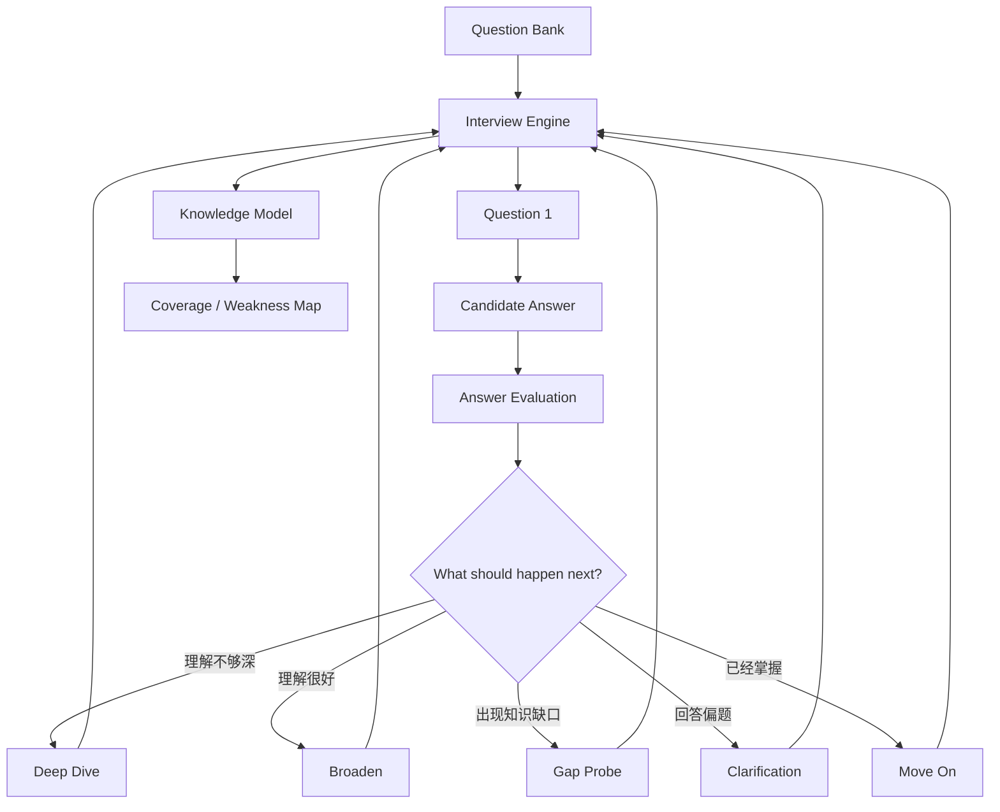
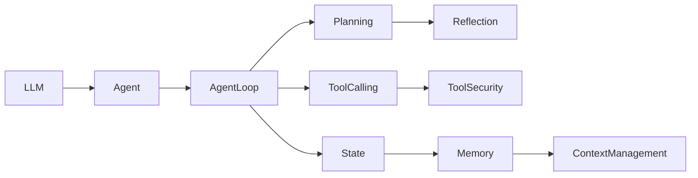
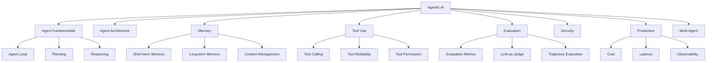
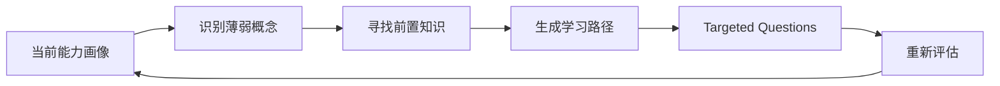
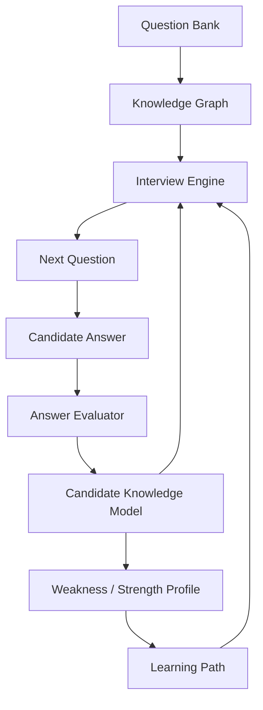

----------------
**问题**
----------------

如何让问题有关联性，类似面试中，问题不会简单从题库抽出就一个一个问，可能是根据前一个回答，进行深入确保面试人的理解深度，或者寻找另一个方向确保面试人的知识广度，该如何做？另外是否可以做一个知识覆盖面的功能，类似知识图，告诉面试人哪些地方他们比较薄弱，应该增强.


----------------
**回答**
----------------


对，而且我认为这实际上应该成为你这个产品的**核心机制**。

你现在想做的已经不是：

> Question Bank → Random Question → Answer → Score

而应该变成：

> **Interview State → Select Next Question → Probe / Broaden → Update Knowledge Model → Select Next Question**

也就是说，**题库只是“素材库”，真正负责面试的是 Interview Engine。**

## 1. 核心设计：不要让 Question 决定下一题，让 Interview State 决定

可以把系统设计成：



关键变化是：

**下一道题不是随机的，而是一次决策。**

---

# 2. 一道题应该拥有“知识关系”

例如你的题库里面有：

> 什么是 Agent Loop？

不要只保存：

```json
{
  "question": "什么是 Agent Loop？"
}
```

而应该保存成一个 **Knowledge-linked Question**：

```json
{
  "id": "agent-loop-001",
  "concepts": [
    "agent-loop",
    "tool-calling",
    "state-management",
    "planning"
  ],
  "prerequisites": [
    "llm",
    "tool-calling"
  ],
  "related": [
    "react",
    "planning",
    "workflow-vs-agent"
  ],
  "tests": [
    "conceptual-understanding",
    "architecture",
    "tradeoff"
  ]
}
```

于是题目之间自然形成关系。

例如：



这就是你所谓的**知识图谱的基础**。

---

# 3. 更重要的是：题目之间应该有“面试关系”

这个比普通知识图谱更重要。

例如：

### Q1

> 什么是 Agent Loop？

候选人回答：

> Agent 不断观察环境，然后决定下一步 Action，执行 Tool，再根据结果继续执行。

这个回答不错。

系统就可以判断：

```text
Agent Loop
├── conceptual understanding: strong
├── tool interaction: strong
├── planning: unknown
├── state: unknown
└── failure handling: unknown
```

所以**不应该随机跳到下一题**。

可以继续：

### Q2 — Deep Dive

> 如果 Agent 调用了一个 Tool，但是 Tool 返回错误，你认为 Agent Loop 应该如何处理？

这是对：

```text
Agent Loop
    ↓
Tool Calling
    ↓
Failure Handling
```

的纵向深入。

如果回答：

> retry 就可以。

那么系统发现：

```text
Tool Failure Handling
    confidence: low
```

继续：

### Q3

> 如果这个 Tool 是“创建订单”，retry 可能会造成什么问题？

这一下就进入：

```text
Retry
 ↓
Idempotency
 ↓
Distributed Systems
 ↓
Agent Reliability
```

这才是真正的**面试追问**。

---

# 4. 但是如果 Q2 回答很好，就应该“横向扩展”

假设 Q2 回答：

> Tool failure 可以根据错误类型处理。Transient error 可以 retry，validation error 应该修正参数，authorization error 应该停止，而对于有副作用的操作还要考虑 idempotency 和 duplicate execution。

这个回答已经很好。

那么继续深挖：

> 那么在 Multi-Agent 系统里，如果两个 Agent 同时调用这个 Tool，你会如何保证 idempotency？

这就从：

```text
Agent
 ↓
Tool
 ↓
Failure
```

进入：

```text
Agent
 ↓
Multi-Agent
 ↓
Concurrency
 ↓
Distributed Systems
```

这就是**动态追问路径**。

---

# 5. 所以 Interview Engine 实际上是在做“知识探索”

我建议定义 5 种 Question Transition。

```text
                    ┌── Deep Dive
                    │
                    ├── Clarify
                    │
Current Answer ─────┼── Gap Probe
                    │
                    ├── Broaden
                    │
                    └── Move On
```

### ① Deep Dive

判断：

> 你是真的理解，还是只是知道定义？

例如：

```text
What is RAG?
    ↓
How does retrieval work?
    ↓
Why can naive chunking fail?
    ↓
How would you evaluate retrieval quality?
    ↓
How would you debug poor retrieval?
```

---

### ② Gap Probe

候选人回答中暴露了一个缺口。

例如：

> 我会使用 Vector DB 存 Memory。

面试官可以立即问：

> 为什么一定要用 Vector DB？哪些 Memory 更适合使用 SQL 或 KV Store？

这样测试的不是“会不会 Vector DB”，而是：

**有没有架构判断能力。**

---

### ③ Broaden

候选人已经证明自己理解当前概念。

那就换方向：

```text
RAG
 ↓
Evaluation
 ↓
Agent Evaluation
 ↓
Production Observability
```

避免整场面试只围绕一个主题。

---

### ④ Contradiction Probe

这个我非常推荐。

如果候选人前面说：

> Agent 应该尽量自主。

后面又说：

> 企业生产环境应该限制 Agent 的 Tool。

系统可以发现潜在矛盾：

> 你刚才提到 Agent 应该尽可能自主，但现在又认为生产环境应该限制 Tool。你如何定义这两者之间的边界？

这非常接近真正的 Senior/Staff 面试。

---

### ⑤ Move On

如果：

```text
concept = strong
depth = strong
confidence = high
```

就不要继续浪费时间。

转移到一个尚未覆盖的知识区域。

---

# 6. 这就引出了你说的“知识覆盖面”

我认为**一定要做**。

但不要简单做成：

> Agent 80%
> RAG 60%
> Memory 40%

这太粗糙。

应该做成一个 **Knowledge Coverage Graph**。

例如：



然后每次回答都会更新节点状态。

---

# 7. 不要只记录“对/错”，而要记录 Knowledge Evidence

比如：

```json
{
  "concept": "tool-reliability",
  "mastery": 0.72,
  "confidence": 0.84,
  "evidence": [
    {
      "question": "tool-failure-001",
      "score": 0.85
    },
    {
      "question": "idempotency-002",
      "score": 0.61
    }
  ]
}
```

更进一步：

```json
{
  "concept": "tool-reliability",
  "dimensions": {
    "definition": 0.90,
    "implementation": 0.78,
    "debugging": 0.60,
    "tradeoff": 0.45,
    "architecture": 0.72
  }
}
```

这就非常有价值了。

因为：

> “你懂 Tool Reliability”

和

> “你知道 Tool Reliability 的概念，但在 architecture trade-off 上比较弱”

完全是两回事。

---

# 8. 最终给用户看的不是分数，而是“能力地图”

例如：

```text
Agentic AI Interview Profile

                    Strong
                      ▲
                      │
       Tool Calling  ●──────● Agent Loop
                      │
       Planning     ● │
                    │ │
     Memory       ● │ │
                  │ │ │
      Evaluation ● │ │
                │ │ │
 Security      ● │ │
              │ │ │
        Multi-Agent ●
              │
              └──────────────────►
                         Weak
```

或者更产品化一点：

### 🟢 Strong

* Agent fundamentals
* Tool calling
* RAG architecture

### 🟡 Developing

* Planning
* Memory
* Agent evaluation

### 🔴 Weak

* Multi-agent coordination
* Agent security
* Production reliability

然后告诉用户：

> **建议优先学习：Agent Evaluation → Multi-Agent → Production Reliability**

这比一个“总分 72/100”有用得多。

---

# 9. 甚至可以生成“下一阶段学习路径”

例如：



比如发现：

```text
Multi-Agent = 42%
```

但是进一步分析：

```text
Multi-Agent
├── Agent Communication      72%
├── Coordination             65%
├── Shared State              38%
├── Conflict Resolution       31%
└── Failure Recovery          28%
```

系统就不会告诉用户：

> “你 Multi-Agent 比较弱。”

而是：

> **你的 Multi-Agent 基础概念已经足够，但 Shared State、Conflict Resolution 和 Failure Recovery 明显薄弱。建议先补 Distributed State + Agent Coordination，再重新进行 Multi-Agent Architecture 面试。**

这就从 **Interview App** 变成了：

> **Interview + Assessment + Personalized Learning System**

---

# 10. 我甚至建议把系统内部拆成 4 个模型

这是我认为你现在架构上最值得调整的地方。



### ① Question Bank

负责：

> **有什么题？**

---

### ② Knowledge Graph

负责：

> **这些题测试什么知识？它们之间有什么关系？**

---

### ③ Candidate Knowledge Model

负责：

> **这个人目前知道什么？不知道什么？理解到什么深度？**

---

### ④ Interview Engine

负责：

> **基于当前证据，下一步最值得问什么？**

这个架构非常重要。

**不要把“题目推荐”直接写进 Question Bank。**

否则后面很容易变成：

```text
if score < 60:
   next_question = xxx
```

最后会越来越像一个复杂的规则系统。

---

# 11. Interview Engine 可以变成一个“面试策略 Agent”

甚至可以让 LLM 每轮输出类似：

```json
{
  "candidate_state": {
    "agent_loop": 0.86,
    "tool_calling": 0.82,
    "reliability": 0.51,
    "memory": 0.34
  },

  "coverage": {
    "architecture": 0.72,
    "engineering": 0.61,
    "security": 0.28
  },

  "next_strategy": "deep_dive",

  "reason": "Candidate understands basic tool calling but has not demonstrated production reliability knowledge.",

  "target_concepts": [
    "idempotency",
    "retry",
    "failure-recovery"
  ],

  "question_constraints": {
    "difficulty": "hard",
    "avoid": ["basic-tool-calling"],
    "must_probe": ["idempotency"]
  }
}
```

然后再由一个 **Question Selector** 从题库中找最合适的问题。

这样 LLM 不负责“凭空出题”，而是：

> **决定面试策略 → 从结构化题库选择问题**

可靠性会高很多。

---

## 12. 最后，我会把你的产品定位稍微改变一下

你最开始想的是：

> **Agentic AI Interview Practice**

我现在更倾向于把核心模型定义成：

> **Adaptive Technical Interview Engine**

上面可以有：

```text
              Adaptive Interview
                     │
       ┌─────────────┼─────────────┐
       ▼             ▼             ▼
   Deep Dive      Broaden       Gap Probe
       │             │             │
       └─────────────┼─────────────┘
                     ▼
             Candidate Model
                     │
          ┌──────────┴──────────┐
          ▼                     ▼
   Knowledge Graph       Skill Profile
          │                     │
          └──────────┬──────────┘
                     ▼
              Learning Path
```

**这其实就是你这个项目真正的护城河。**

题目本身很容易被 LLM 生成，5000 道题也不稀缺；但如果你建立了：

**Question → Concept → Evidence → Candidate Model → Adaptive Interview → Knowledge Coverage → Learning Recommendation**

这一整套闭环，就已经不是一个简单的“AI 面试题库”了。

而且这和你之前提到的**记录用户交互、打分、给建议、记忆**是完全一致的——那部分不应该只是附属功能，而应该成为整个产品的数据核心。
