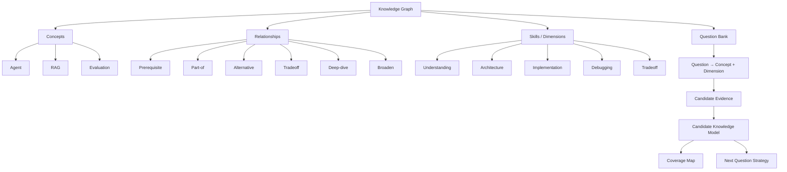

有，而且你现在这个 Graph **已经有一个不错的雏形**，但它目前更像：

> **Question prerequisite / related-topic dependency map**

还没有真正达到我们上一轮讨论的 **Adaptive Interview Knowledge Graph**。

最大的改进不是“再增加更多 concept”，而是把**关系类型、方向、层级、能力维度、证据状态**建起来。

---

# 1. 目前最大的一个问题：`related` 和 `prerequisites` 信息量不够

你现在：

```json
"related": {
  "agent-evaluation": [
    "evaluation",
    "llm-as-judge",
    "monitoring"
  ]
}
```

系统不知道：

* evaluation 和 agent-evaluation 是什么关系？
* monitoring 是 prerequisite 还是 downstream？
* llm-as-judge 是实现方式还是子概念？
* agent-evaluation 和 evaluation 哪个更基础？
* 从一个 concept 跳到另一个 concept，应该问什么类型的问题？

所以我建议从：

```text
related
prerequisites
```

升级成：

```text
relationships
```

例如：

```json
{
  "from": "agent-evaluation",
  "to": "llm-as-judge",
  "type": "technique",
  "direction": "downstream",
  "strength": 0.8
}
```

---

# 2. 建议至少支持 8 种关系

这是我认为最值得加的。

```text
prerequisite
part_of
related_to
alternative
technique
tradeoff
extends
contrasts
```

例如：

```text
RAG
├── part_of → Agent Architecture
├── alternative → Fine-tuning
├── technique → Retrieval
├── prerequisite → Embedding
├── tradeoff → Context Engineering
└── contrasts → Long-context
```

这样你的 Graph 才能真正支持“面试追问”。

---

# 3. `prerequisite` 最好改成有向 DAG，而不是普通 list

例如你现在：

```json
"react": ["agent-fundamentals", "tool-calling"]
```

这个是对的。

但是应该明确：

```text
agent-fundamentals
        │
        ▼
   tool-calling
        │
        ▼
       ReAct
```

而不是：

```text
ReAct
 ├─ Agent Fundamentals
 └─ Tool Calling
```

因为未来你需要计算：

> “候选人的基础知识不足，会不会影响他回答高级问题？”

例如：

```text
Multi-Agent
    ↓
Agent Communication
    ↓
Shared State
    ↓
Consistency
    ↓
Distributed Coordination
```

如果 `Shared State` 很弱，那么系统就应该知道：

> Multi-Agent Architecture 的高级题暂时不适合继续问。

---

# 4. 你现在缺少一个非常重要的东西：`domain`

你的 Graph 现在把：

```text
Agent
RAG
GQA
BPE
Gradient Descent
Batch Norm
```

全部放在一个平面上。

长期会非常难管理。

建议增加：

```json
{
  "concept": "agent-evaluation",
  "domain": "agentic-ai",
  "subdomain": "evaluation"
}
```

例如：

```text
AI
├── Machine Learning
│   ├── Optimization
│   ├── Regularization
│   └── Deep Learning
│
├── LLM
│   ├── Tokenization
│   ├── Attention
│   ├── KV Cache
│   └── MoE
│
└── Agentic AI
    ├── Fundamentals
    ├── Tool Use
    ├── Planning
    ├── Memory
    ├── Multi-Agent
    ├── Evaluation
    ├── Security
    └── Production
```

这样你的 **Knowledge Coverage** 才能真正做出来。

---

# 5. 更重要：增加 `skill dimensions`

这是我最推荐你增加的一层。

因为：

> **Concept ≠ Skill**

例如：

```text
concept = RAG
```

一个候选人可能：

```text
definition       90
architecture     80
implementation   60
debugging        30
tradeoff         20
```

所以 Graph 中最好定义：

```json
{
  "concept": "rag",
  "skills": [
    "understanding",
    "architecture",
    "implementation",
    "debugging",
    "tradeoff"
  ]
}
```

然后候选人的 Knowledge Model：

```json
{
  "rag": {
    "understanding": 0.91,
    "architecture": 0.78,
    "implementation": 0.62,
    "debugging": 0.31,
    "tradeoff": 0.24
  }
}
```

这样你的“薄弱点”就会非常准确。

---

# 6. 你现在的 Graph 其实混合了 3 种不同东西

例如：

```text
rag
rag-pipeline
hallucination
rag-vs-finetuning
```

这些并不是同一层级。

我会拆成：

```text
Concept
Technique
Decision
Problem
```

例如：

```text
RAG                         → Concept
RAG Pipeline                → Architecture / Technique
Hallucination               → Problem
RAG vs Fine-tuning          → Decision / Tradeoff
```

这是非常重要的。

否则 Graph 很快会变成“所有东西都是 node”。

---

# 7. 建议增加 `node_type`

例如：

```json
{
  "nodes": {
    "rag": {
      "type": "concept"
    },

    "rag-pipeline": {
      "type": "architecture"
    },

    "hallucination": {
      "type": "problem"
    },

    "rag-vs-finetuning": {
      "type": "tradeoff"
    },

    "llm-as-judge": {
      "type": "technique"
    }
  }
}
```

我建议至少：

```text
concept
architecture
technique
problem
pattern
tradeoff
decision
technology
metric
skill
```

---

# 8. 你现在还有一个明显的问题：很多边是“双向重复的”

例如：

```json
"rag": ["rag-pipeline", ...],

"rag-pipeline": ["rag", ...]
```

这实际上是：

```text
RAG ↔ RAG Pipeline
```

但 Graph 数据最好只保存一条：

```json
{
  "from": "rag",
  "to": "rag-pipeline",
  "type": "implemented-by"
}
```

这样可以避免：

* graph duplication
* edge inconsistency
* update 困难
* traversal 复杂

---

# 9. 更值得增加的是“面试关系”

这是你当前 Graph 最缺的一层。

比如：

```text
agent-loop
      │
      ├── DEEPEN → tool-failure
      │
      ├── BROADEN → planning
      │
      ├── CHALLENGE → workflow-vs-agent
      │
      └── DEBUG → agent-debugging
```

所以建议关系里面增加：

```text
interview_transition
```

例如：

```json
{
  "from": "agent-loop",
  "to": "tool-failure",
  "type": "deep-dive"
}
```

以及：

```json
{
  "from": "agent-loop",
  "to": "workflow-vs-agent",
  "type": "challenge"
}
```

这会直接服务你的 Adaptive Interview Engine。

---

# 10. 甚至可以给每个 Concept 定义“问题维度”

比如：

```json
{
  "id": "tool-calling",

  "dimensions": [
    "definition",
    "mechanism",
    "architecture",
    "implementation",
    "failure-mode",
    "security",
    "performance",
    "tradeoff"
  ]
}
```

那么题目：

> 什么是 Tool Calling？

覆盖：

```text
definition
```

而：

> Tool Calling 失败应该怎么处理？

覆盖：

```text
failure-mode
architecture
```

而：

> MCP 和传统 Function Calling 怎么选择？

覆盖：

```text
architecture
tradeoff
```

于是系统可以发现：

```text
Tool Calling
────────────────────
definition      ██████████ 92%
mechanism       ████████░░ 78%
architecture    ██████░░░░ 61%
implementation  █████░░░░░ 52%
failure         ███░░░░░░░ 31%
security        ██░░░░░░░░ 22%
tradeoff        ███░░░░░░░ 29%
```

这才是真正有价值的 **Knowledge Coverage**。

---

# 11. 我会进一步增加 `evidence`

这一点非常重要。

Graph 本身描述：

> **知识是什么**

Candidate Model 描述：

> **这个人掌握多少**

Evidence 描述：

> **为什么我们认为他掌握这些**

例如：

```json
{
  "concept": "idempotency",
  "mastery": 0.68,

  "evidence": [
    {
      "question": "tool-failure-002",
      "dimension": "architecture",
      "score": 0.82
    },
    {
      "question": "payment-agent-003",
      "dimension": "implementation",
      "score": 0.54
    }
  ]
}
```

这会让你的评分系统从：

> LLM 觉得你 68 分

变成：

> **基于 4 个相关问题，你在 Idempotency 的 Architecture 维度较强，但 Implementation 证据不足。**

可信度会高很多。

---

# 12. 我建议最终架构成三层

这可能是你现在最应该调整的地方。



---

# 13. 你的现有 JSON 不需要推倒重来

我反而建议**渐进式演进**。

当前：

```json
{
  "related": {},
  "prerequisites": {}
}
```

第一步：

```json
{
  "nodes": {},
  "edges": []
}
```

第二步给 node 增加：

```json
{
  "id": "rag",
  "type": "concept",
  "domain": "agentic-ai",
  "dimensions": [
    "understanding",
    "architecture",
    "implementation",
    "debugging",
    "tradeoff"
  ]
}
```

Edge：

```json
{
  "from": "rag",
  "to": "rag-pipeline",
  "type": "part-of",
  "weight": 0.9
}
```

最后再增加：

```json
{
  "interview": {
    "deep_dive": [],
    "broaden": [],
    "challenge": [],
    "gap_probe": []
  }
}
```

这样你的 Graph 就从：

> **静态知识关系**

逐渐变成：

> **Knowledge Graph + Interview Graph + Assessment Graph**

---

## 我认为最关键的变化

你现在的 Graph 是：

```text
Concept A ─── related ───> Concept B
       │
       └── prerequisite ──> Concept C
```

我建议最终变成：

```text
                    Knowledge Graph
                          │
          ┌───────────────┼───────────────┐
          ▼               ▼               ▼
       Concepts       Relationships     Dimensions
          │               │               │
          └───────────────┼───────────────┘
                          ▼
                    Question Graph
                          │
                          ▼
                  Candidate Evidence
                          │
                          ▼
                 Candidate Knowledge
                          │
             ┌────────────┴────────────┐
             ▼                         ▼
       Coverage Map              Interview Engine
                                       │
                          ┌────────────┼────────────┐
                          ▼            ▼            ▼
                       Deep Dive    Broaden     Gap Probe
```

**这样一来，你的 Concept Graph 就不只是为了“组织题库”，而会成为整个产品的核心数据结构。**

尤其是你现在已经有 `related`、`prerequisites`、tradeoff 这些信息，说明实际上已经走在正确方向上；我不会建议你现在重新人工设计一个庞大的知识图谱，而是先把现有数据**正规化成 node + typed edge + dimension**，然后让题目和候选人的 evidence 挂到这个 Graph 上。这样后面做自适应追问和知识覆盖图会顺很多。
